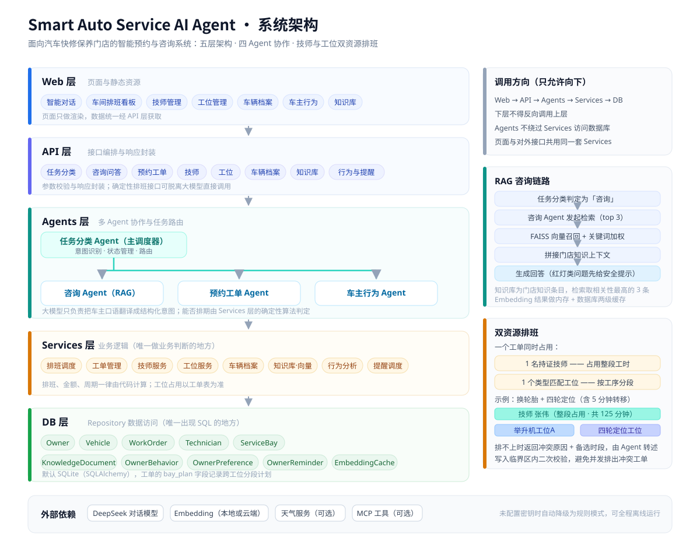

# Smart Auto Service AI Agent

Smart Auto Service AI Agent 是一个面向汽车快修保养门店场景的智能预约与咨询系统。项目基于 FastAPI、LangChain、FAISS、SQLite 和多 Agent 协作架构，实现了意图识别、RAG 知识问答、技师与工位双资源排班、保养工单管理、车主行为分析和保养周期提醒等能力。

这个项目的核心目标不是只做一个普通的预约表单，而是尝试把门店前台与车间调度日常需要处理的高频工作自动化：理解车主是在咨询还是预约，识别车辆信息和当前里程，判断该做哪些保养项目，匹配同时可用的技师和工位，检查时间窗是否冲突，生成工单，并在必要时结合天气、里程和历史工单给出更贴近实际用车场景的提醒与加项建议。

与常见的"预约表单 + 客服问答"不同，汽车保养门店的难点在于**一个工单需要同时占用两种资源**：一名具备对应资质的技师，和一个类型匹配的空闲工位。这让排班从"挑一个空闲时间段"变成了带约束的联合调度问题，也是本项目最核心的工程挑战。

## 项目背景

在一次去门店做小保养的体验中，我注意到前台和车间调度需要同时处理大量复杂事务：一边接电话记预约，一边要确认举升机工位是否空着，还要判断手头这位技师有没有换轮胎的资质；车主往往说不清自己的车该做什么项目、上次换的是什么标号的机油；雨雪天之后电瓶和轮胎的咨询量会突然暴涨；而同一台车的里程、上次保养时间、质保到期日又散落在不同的本子和系统里。

随着门店接待量和项目复杂度上升，传统人工前台模式很容易出现问题：沟通成本高、工位与技师冲突、等待时长不可预期、加项推荐全凭口才而不是依据、"该保养了"的提醒发不出去。

因此，本项目尝试用 AI Agent 的方式重构这一流程：让系统像一个智能服务顾问一样主动理解车主需求，把咨询、预约、档案分析等不同任务分发给对应的专业 Agent 处理，并把"理解需求"和"做调度决策"这两件事严格分开。它既适用于快修保养门店，也可以扩展到需要人员排班、设备调度和智能客服的其他服务行业。

## 核心能力

- **智能任务分类**：自动识别车主是在咨询服务与价格、预约保养工单、查询车辆档案，还是触发车主行为分析，并将请求路由到对应 Agent。
- **多 Agent 协作**：通过任务分类 Agent、咨询 Agent、预约工单 Agent 和车主行为 Agent 分工处理复杂流程，减少单个模块的职责膨胀。
- **RAG 知识咨询**：使用 FAISS 向量索引检索知识库内容，结合大模型生成自然语言回答，支持流式输出。
- **双资源智能排班**：一个工单需同时占用一名技师和一个类型匹配的工位，系统在技师资质、工位设备、标准工时和已有工单之间做联合校验，避免"有技师没工位"或"有工位没人做"的冲突。
- **项目依赖与工时估算**：支持多项目组合预约，按项目之间的物理依赖推算先后顺序与总工时（例如更换刹车片必须在举升机工位完成、四轮定位需在换胎之后进行），保证排出的时间窗在车间里真的做得到。
- **保养工单管理**：管理工单的创建、改约、取消和完成状态，记录实际项目、用料、工时和结算金额，作为后续周期推算和推荐的数据来源。
- **车辆档案与周期推理**：记录车型、年款、车牌、里程、上次保养时间与油品规格，按里程和时间双维度推算下次保养、年检、电瓶和刹车片的触发点。
- **车主行为分析**：记录车主的咨询、预约、取消、加项接受等行为，分析价格敏感度、常用门店和偏好技师，为后续推荐和话术调整提供依据。
- **个性化提醒**：结合实时天气、里程变化和历史工单生成提醒，例如雨雪降温前的电瓶与轮胎检查、长途出行前的整车检查。
- **Embedding 缓存优化**：通过数据库缓存和文件缓存减少重复向量计算，提高知识检索性能。
- **数据管理能力**：支持知识库、技师、工位、车辆档案和车主行为数据的增删改查，并在数据变化后自动维护索引。
- **外部工具接入**：通过 MCP 接入天气、车辆限行等实时信息，作为调度与提醒的上下文。
- **日志与兜底机制**：保留关键处理过程日志，在信息不足、排期无解或异常情况下提供更稳定的降级处理。

## 系统架构

项目采用严格的五层架构，核心原则是：**下层不能反向调用上层**。这样可以避免循环依赖，让业务逻辑、数据访问和接口编排保持清晰边界。

```text
Web & Application Layer
    ↓  app.py, web/：页面、路由入口、系统启动
API Layer
    ↓  api/：外部接口、请求编排、响应封装
Agents Layer
    ↓  agents/：AI Agent、任务路由、对话流程控制
Services Layer
    ↓  services/：业务逻辑、排班算法、向量处理
DB Layer
    ↓  db/：数据模型、数据库连接、Repository
```

### 允许的调用方向

- Web 层调用 API 层
- API 层调用 Agents 层或 Services 层
- Agents 层调用 Services 层
- Services 层调用 DB 层

### 禁止的调用方式

- 下层反向调用上层
- Web 层绕过 API 直接访问 Services 或 DB
- Agents 层绕过 Services 直接访问 DB
- Services 层调用 Agents、API 或 Web

## 业务模型

系统围绕五个核心对象组织数据，理解这五个对象的关系就能理解整个项目的业务约束：

```text
车主 Owner
    ↓ 1 : N
车辆 Vehicle（车牌、车型、年款、里程、油品规格、保养周期）
    ↓ 1 : N
工单 Work Order（时间窗、项目组合、技师、工位、状态、金额）
    ↑
技师 Technician（专长、资质等级、班次）
工位 Service Bay（类型、设备、可承接项目）
```

其中最关键的是工单与技师、工位之间的**双资源占用**关系：

- 一个工单在它的时间窗内，必须同时锁定 1 名技师和 1 个工位；
- 工位有类型区分（举升机工位、四轮定位工位、钣喷房、洗车工位、快修工位），只有类型匹配且设备可用的工位才能承接对应项目；
- 技师有资质区分，钣喷、四轮定位、高压电控等项目只允许持证技师操作；
- 工单时长取项目标准工时之和，多项目组合时还要满足项目之间的先后依赖。

任何一次成功预约，本质上都是在这个二维约束空间里找到一个可行的解。这正是本项目区别于普通预约系统的地方。

## Agent 设计

### Task Classification Agent

任务分类 Agent 是系统的主调度器，负责分析车主输入、判断任务类型，并把请求分发给合适的专业 Agent。

```text
车主输入 → 意图分析 → Agent 路由 → 响应协调
```

主要职责：

- 判断车主意图（咨询、预约、改约、查档案、行为分析、无关问题）
- 维护对话状态
- 控制不同 Agent 之间的切换
- 处理无法分类或超出能力范围的问题

### Consultation Agent

咨询 Agent 负责知识问答场景，使用 RAG 流程从知识库中检索相关内容，再结合大模型生成回答。汽车保养涉及安全，回答必须基于可控知识来源，仪表盘红灯类问题还要给出明确的安全建议。

```text
任务分类 → 知识检索 → FAISS 相似度搜索 → 流式回答
```

主要职责：

- 区分咨询问题类型（保养周期、故障灯、异响排查、价格口径、材料规格、质保政策）
- 从知识库检索相关内容
- 构建提示词，约束回答不能超出知识库范围
- 对高风险问题给出"建议尽快到店检查"的明确指引
- 生成自然语言回答

### Service Booking Agent

预约工单 Agent 负责预约相关流程，包括解析车主输入、识别车辆、估算项目与时长、匹配技师与工位、检查排期可行性、生成工单和确认消息。

```text
任务分类 → 解析预约需求 → 车辆识别 → 项目与工时估算
        → 技师 + 工位双资源匹配 → 冲突校验 → 工单确认
```

主要职责：

- 提取车型、车牌、里程、期望时间、项目需求等信息
- 匹配已有车辆档案，或引导车主建立新档案
- 根据里程与历史工单推算建议项目，并在车主同意后加入工单
- 估算项目组合的总工时与先后依赖
- 联合匹配可用技师与可用工位，检测时间窗冲突
- 处理信息缺失时的追问
- 生成预约结果和提醒

### Vehicle Behavior Agent

车主行为 Agent 更偏向后台智能分析，不完全依赖车主的显式请求。它会根据交互记录、工单历史和车辆档案分析行为模式，为后续推荐和主动提醒提供依据。

```text
行为记录 → 模式分析 → 偏好更新 → 周期触发 → 个性化推荐
```

主要职责：

- 记录车主行为（咨询话题、预约、取消、加项接受或拒绝）
- 分析价格敏感度、到店习惯和偏好技师
- 按里程与时间推算保养、年检、易损件的到期节点
- 生成推荐依据和主动提醒内容
- 支持个性化服务与升单建议

## 核心设计思想

### 1. 用任务分类降低系统复杂度

系统并不让一个 Agent 处理所有事情，而是先判断车主意图，再分发给对应模块。这样可以让咨询、预约、档案分析等逻辑保持独立，也更容易扩展新的 Agent。

### 2. 用 RAG 解决专业知识回答

保养周期、故障灯含义、机油规格、工时费口径、质保政策这类内容更适合通过知识库维护。RAG 能让回答基于可控知识来源，而不是完全依赖大模型自由生成——这在涉及行车安全的场景里尤其重要。

### 3. 用领域约束把大模型的不确定性关进业务边界

这是本项目最重要的一条设计原则：**大模型负责理解需求，确定性代码负责做调度决策。**

Agent 只负责把车主口语化的表达翻译成结构化的预约意图（车型、里程、项目、时间偏好），而"能不能排出这个档期"完全由 Services 层的排班算法按约束条件判定。这样即使模型理解出现偏差，也不会排出车间里物理上无法执行的工单；算法返回无解时，系统会把冲突原因翻译成自然语言，反过来引导车主换时间或调整项目。

### 4. 用车辆档案让推荐和提醒有依据

系统会记录车辆里程、上次保养时间和用料规格。后续推荐项目或发送提醒时，依据的是这辆车的真实使用情况，而不是每次从零开始询问，也不是对所有人都推同一套套餐。

### 5. 用分层架构保证可维护性

Agent 负责智能流程，Service 负责业务逻辑，Repository 负责数据访问。每层只关心自己的职责，减少后期修改时的连锁影响。

### 6. 为真实业务场景预留扩展空间

项目目前以本地 SQLite 和单体服务为主，但架构上预留了模型提供商切换、MCP 外部服务接入（限行查询、配件库存）、后台任务、多门店隔离、缓存优化和云端部署的扩展方向。

## 架构图



自上而下依次为 Web 层、API 层、Agents 层、Services 层、DB 层；Agents 层展开任务分类主调度器与三个专业 Agent 的派发关系；右侧补充调用方向约束、RAG 咨询链路，以及技师与工位双资源排班的作业示意（技师占用整段工时，工位按工序分段，跨工位时计入转移时间）。

## 技术栈

- **后端框架**：FastAPI、Uvicorn
- **AI 框架**：LangChain
- **大模型接入**：兼容 OpenAI 格式的模型提供商，例如 Qwen、DeepSeek、Zhipu、OpenAI、Azure OpenAI
- **向量检索**：FAISS
- **数据库**：SQLite、SQLAlchemy
- **RAG 能力**：Embedding、向量索引、知识库检索、提示词构建
- **调度能力**：时间窗约束校验、项目依赖排序、技师与工位双资源匹配
- **流式响应**：Python AsyncGenerator
- **前端页面**：Jinja2 模板、静态 CSS
- **外部服务扩展**：MCP，用于天气、限行等外部信息接入
- **配置管理**：python-dotenv
- **后台任务**：schedule

## 项目结构

```text
Smart auto service AI agent/
├── agents/                          # 多 Agent 智能层
│   ├── task_classification_agent.py  # 任务分类与主路由
│   ├── consultant_agent.py           # RAG 咨询 Agent
│   ├── service_booking_agent.py      # 预约工单 Agent
│   ├── vehicle_behavior_agent.py     # 车主行为分析 Agent
│   ├── task_classification/          # 意图识别、状态管理、路由逻辑
│   ├── consultant/                   # 知识检索、提示词、回答生成
│   ├── service_booking/              # 需求解析、车辆识别、工时估算、双资源匹配
│   └── vehicle_behavior/             # 行为记录、偏好管理、周期推算
├── api/                             # API 编排层
│   ├── service_booking.py            # 预约工单接口
│   ├── consultation.py               # 咨询接口
│   ├── task.py                       # 任务分类接口
│   ├── chat_handler.py               # 流式聊天处理
│   ├── technician.py                 # 技师管理接口
│   ├── bay.py                        # 工位管理接口
│   ├── vehicle.py                    # 车辆档案接口
│   ├── knowledge.py                  # 知识库管理接口
│   └── vehicle_behavior_analysis.py  # 车主行为分析接口
├── services/                        # 业务逻辑层
│   ├── work_order_service.py         # 工单业务逻辑
│   ├── scheduling_service.py         # 双资源排班与冲突检测
│   ├── recommendation_service.py     # 项目与技师推荐逻辑
│   ├── technician_service.py         # 技师信息管理
│   ├── bay_service.py                # 工位信息管理
│   ├── vehicle_service.py            # 车辆档案管理
│   ├── knowledge_service.py          # 知识库管理
│   ├── text_embedding.py             # Embedding 与向量处理
│   └── vehicle_behavior_service.py   # 车主行为服务
├── db/                              # 数据持久化层
│   ├── models.py                     # SQLAlchemy 模型
│   ├── db_router.py                  # 数据库路由
│   ├── local_db.py                   # 本地数据库操作
│   ├── base/                         # 数据库基础接口
│   └── repositories/                 # Repository 数据访问封装
├── config/                          # 配置模块
│   ├── constants.py                  # 常量与枚举
│   ├── database.py                   # 数据库配置
│   ├── model_provider.py             # 模型与 Embedding Provider 工厂
│   ├── settings.py                   # 应用配置
│   └── time_config.py                # 营业时间、班次与工位时段配置
├── web/                             # Web 页面层
│   ├── routes.py                     # 页面路由
│   ├── templates/                    # HTML 模板
│   └── static/                       # 静态资源
├── mcp-server/                      # MCP 外部服务扩展
├── data/                            # 数据库与缓存目录
├── tests/                           # 测试用例
├── app.py                           # 应用入口
├── requirements.txt                 # Python 依赖
├── .env.example                     # 环境变量模板
├── architecture.svg                 # 系统架构图
└── README.md                        # 项目说明
```

## 快速开始

### 1. 创建虚拟环境

```bash
python -m venv .venv
```

Windows PowerShell：

```powershell
.\.venv\Scripts\Activate.ps1
```

Windows CMD：

```cmd
.venv\Scripts\activate.bat
```

macOS 或 Linux：

```bash
source .venv/bin/activate
```

### 2. 安装依赖

```bash
pip install -r requirements.txt
```

### 3. 配置环境变量

复制环境变量模板：

```bash
cp .env.example .env
```

Windows PowerShell 可以使用：

```powershell
Copy-Item .env.example .env
```

然后在 `.env` 中填写模型和数据库配置。项目支持 OpenAI 兼容格式的大模型与 Embedding 服务。

```env
MODEL_PROVIDER=qwen
LLM_API_KEY=your_llm_api_key_here
LLM_BASE_URL=your_openai_compatible_chat_base_url_here
LLM_MODEL=your_chat_model_name_here

EMBEDDING_PROVIDER=qwen
EMBEDDING_API_KEY=your_embedding_api_key_here
EMBEDDING_BASE_URL=your_openai_compatible_embedding_base_url_here
EMBEDDING_MODEL=your_embedding_model_name_here

DATABASE_URL=sqlite:///./data/smart_auto_service.db

DEBUG=True
LOG_LEVEL=INFO
```

常见配置方向：

- Qwen：使用阿里云百炼或 DashScope 的模型、Base URL 和 API Key。
- DeepSeek：可用于聊天模型，Embedding 可搭配其他兼容服务。
- Zhipu：可配置智谱的聊天模型和向量模型。
- Azure OpenAI：将 `MODEL_PROVIDER` 设置为 `azure`，并补充对应的 Azure OpenAI 环境变量。

### 4. 启动服务

```bash
python -m uvicorn app:app --host 127.0.0.1 --port 8000 --reload
```

如果 8000 端口已被占用，可以换成 8001：

```bash
python -m uvicorn app:app --host 127.0.0.1 --port 8001 --reload
```

启动后可以访问：

- Web 页面：http://127.0.0.1:8000
- API 文档：http://127.0.0.1:8000/docs
- ReDoc 文档：http://127.0.0.1:8000/redoc

## 测试

运行全部测试：

```bash
pytest
```

运行单个测试文件：

```bash
pytest tests/test_task_classification_agent.py
pytest tests/test_service_booking_agent.py
pytest tests/test_scheduling_service.py
```

## 主要页面

- 首页聊天与预约入口：`web/templates/index.html`
- 知识库管理：`web/templates/knowledge_management.html`
- 技师管理：`web/templates/technician.html`
- 工位管理：`web/templates/bay_management.html`
- 车间排班看板：`web/templates/schedule_board.html`
- 车辆档案：`web/templates/vehicle_archive.html`
- 车主行为分析：`web/templates/vehicle_behavior_analysis.html`

## 后续规划

### 更强的 Agent 自主能力

- 增加 Agent 自我反思机制，让系统能够评估回答质量和预约成功率。
- 引入更完整的多轮推理链，提升复杂项目组合与档期冲突的处理能力。
- 根据车主真实反馈优化推荐策略和加项建议的边界。

### 更完整的排班求解能力

- 把双资源排班从贪心匹配升级为带约束的求解方案，处理时间窗约束、项目依赖和技师倒班。
- 引入排班回放与仿真，用历史工单评估排班质量、工位利用率和等待时长。
- 支持跨门店的资源调度和产能均衡。

### 更完整的多 Agent 协作

- 增加 Agent-to-Agent 通信机制，减少所有任务都依赖主分类器转发的问题。
- 把车主行为 Agent 的后台分析能力做得更稳定，支持定时任务和主动触达。
- 把预约、推荐、咨询之间的上下文记忆打通得更自然。

### 生产化能力

- 增加用户登录、权限控制和多门店数据隔离。
- 增加更完整的异常处理和边界场景覆盖。
- 优化向量检索性能、缓存策略和响应速度。
- 支持 Docker 部署、云数据库和更标准的日志监控。

## 项目价值

这个项目把多 Agent、RAG、车主行为分析、技师与工位双资源调度和外部工具接入放在同一个真实业务场景中验证。相比普通的预约系统，它需要同时处理自然语言理解和确定性调度约束，并把两者清晰地分层：Agent 负责把车主的口语化需求变成结构化意图，Service 负责在真实约束下判断方案是否可行。

它既是一个汽车保养门店智能前台原型，也可以作为学习 AI Agent 工程化、分层架构、RAG 系统和业务自动化的综合实践项目。

## 实现说明

本项目已按上述设计完成落地实现：

- 五层架构（Web / API / Agents / Services / DB）与本 README 的分层约定一致；
- 四个 Agent（任务分类、咨询、预约工单、车主行为）已实现，并支持在没有大模型密钥时降级为规则模式；
- 双资源排班已落地，并支持同一工单内按项目依赖跨工位作业（例如换胎后再做四轮定位，含工位转移时间）；
- 知识库采用 FAISS 向量检索 + 关键词加权的混合召回，Embedding 带内存与数据库两级缓存；
- 车辆档案支持按里程与时间双维度推算到期项目，并据此生成主动提醒。

聊天模型默认使用 DeepSeek（`MODEL_PROVIDER=deepseek`）。安装、配置、接口清单与设计取舍见
[`docs/DEVELOPMENT.md`](docs/DEVELOPMENT.md)。